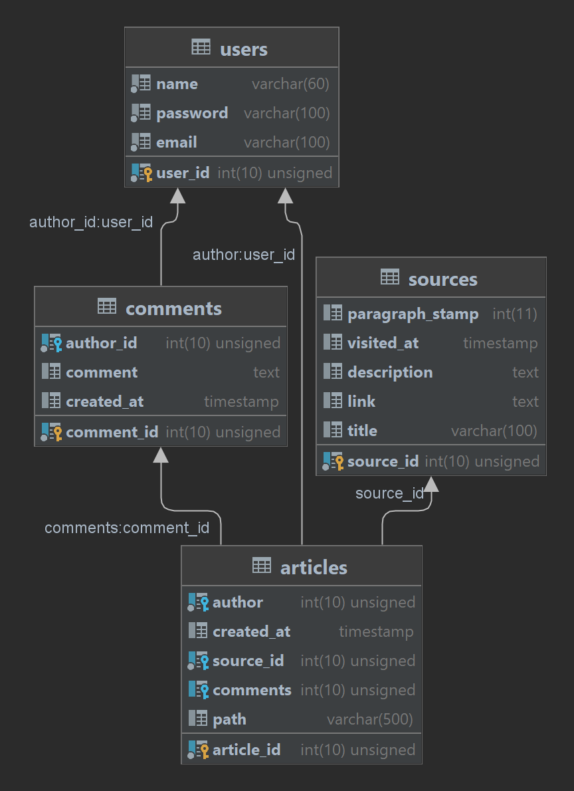

# ProWiki
Wiki welches sich in IT spezialisiert

*Amadeus Abdulkarim*

*16.06.2023*

## Installieren der Frontend Dependencies
1. cd Frontend/prowikiapp
2. npm install
3. npm run dev

## Installieren der Backend Dependencies
1. cd Backend
2. pip install virtualenv 
3. python -m venv venv
4. ./venv/scripts/activate   
   1. Bei einem ExecutionPolicy Error: **Set-ExecutionPolicy Unrestricted -Scope Process**
5. pip install Flask

## Einführung

Diese Seite ist dafür gedacht als Wikipedia zu dienen, für Programmierer.
Die Artikel werden auf dem 'Server' als Markdown Dateien gespeichert deren Pfäde in einer Datenbank gespeichert. Das Projekt gilt als Übung zum Backend und benachteiligt daher das Frontend.

Das Backend besteht aus einer REST API und einem SQL Reader der die Datenbank liest. Das Frontend liest die Daten von der Rest-API und stellt sie übersichtlich dar.

## Das Backend

Die API wurde mit FastAPI, einem Python Framework geschrieben.

## Das Frontend

Das Framework welches für das Frontend verwendet wurde ist SolidJS.

## Beiträge

Als Testbeiträge habe ich Markdown Dateien von Benjamin Edlinger und Manuel Durst genommen.

